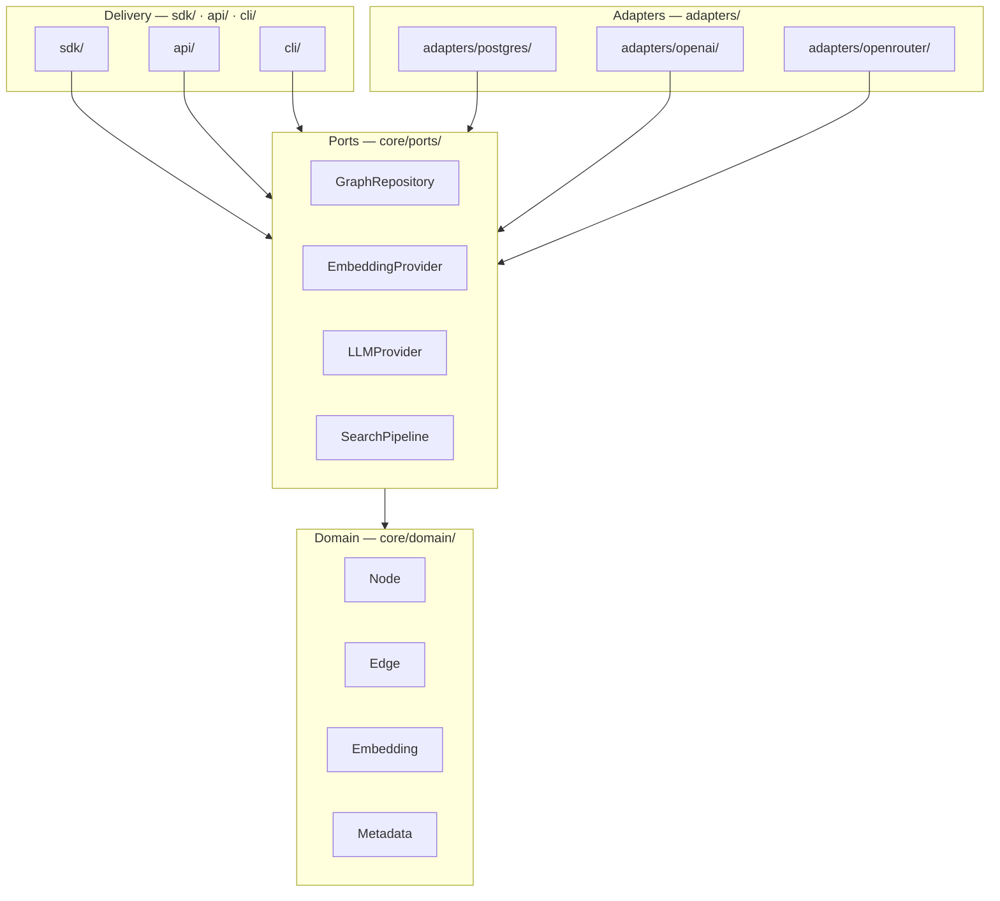

# Architecture Layers

> Clean Architecture layer-to-package mapping: where every concept lives in the codebase.

## Overview

depth-graph-search follows Clean Architecture with four layers. Each layer has a strict ownership over a set of Python packages. Crossing layers is explicit — always via ports. This document maps each layer to its concrete directory path and explains what lives there.

## Layer → Package Mapping

| Layer | Python Package | Imports From |
|-------|---------------|--------------|
| **Domain** | `core/domain/` | — (nothing external) |
| **Ports** | `core/ports/` | `core/domain/` only |
| **Adapters** | `adapters/` | `core/ports/`, `core/domain/`, third-party libs |
| **Delivery — SDK** | `sdk/` | `core/ports/`, `core/domain/` |
| **Delivery — API** | `api/` | `core/ports/`, `core/domain/` |
| **Delivery — CLI** | `cli/` | `core/ports/`, `core/domain/` |

> **v0.1 scope**: Directory structure is defined here as the contract. The actual Python files will be created when implementation begins. Package names are final.

## Domain Entities

The domain layer defines four entities. They carry no database or HTTP logic — they are plain data containers.

| Entity | Description |
|--------|-------------|
| **Node** | A concept or entity extracted from ingested text. Holds content, an embedding vector, and arbitrary metadata. |
| **Edge** | A directed relationship between two Nodes. Carries a relationship type label extracted by the LLM. |
| **Embedding** | A dense vector representation of a Node's content. Generated by an EmbeddingProvider adapter. |
| **Metadata** | Free-form key-value pairs attached to a Node at ingestion time. No fixed schema is enforced. |

Domain entities are immutable by convention. Adapters may persist them but never mutate their fields during retrieval.

## Adapters

Adapters are the only layer that talks to the outside world. Each adapter implements one or more ports.

| Adapter | Port(s) Implemented | Technology |
|---------|-------------------|------------|
| `PostgresGraphRepository` | `GraphRepository` | PostgreSQL + Apache AGE + pgvector |
| `OpenAIProvider` | `EmbeddingProvider`, `LLMProvider` | OpenAI API |
| `OpenRouterProvider` | `LLMProvider` | OpenRouter API |

**Rule**: A new integration (e.g., a Pinecone vector store) is added by creating a new adapter under `adapters/` that implements the relevant port. Core code is never modified.

## Delivery Surfaces

The three delivery surfaces are thin entry points. They wire dependencies (inject adapters into ports) and delegate all logic to the core.

| Surface | Package | Consumer | How it Works |
|---------|---------|----------|--------------|
| **SDK** | `sdk/` | Python developers | Importable library. Caller instantiates and calls directly. |
| **HTTP API** | `api/` | Any HTTP client | REST service wrapping the SDK surface. |
| **CLI** | `cli/` | Terminal users | Command-line interface. Reads args, calls core, prints output. |

All three surfaces share the same core — there is no separate business logic per surface.

> **v0.1 scope**: All three surfaces are specified here. v0.1 implementation priority: SDK first, then API, then CLI.

## See Also

- [Overview](./overview.md) — system boundary diagram and dependency rule
- [Ports & Adapters](./ports-and-adapters.md) — full interface contracts for each port
- [Functional Requirements](../requirements/functional.md) — what each layer must deliver
- [Strategies](./strategies.md) — how the Strategy Pattern extends across adapters
