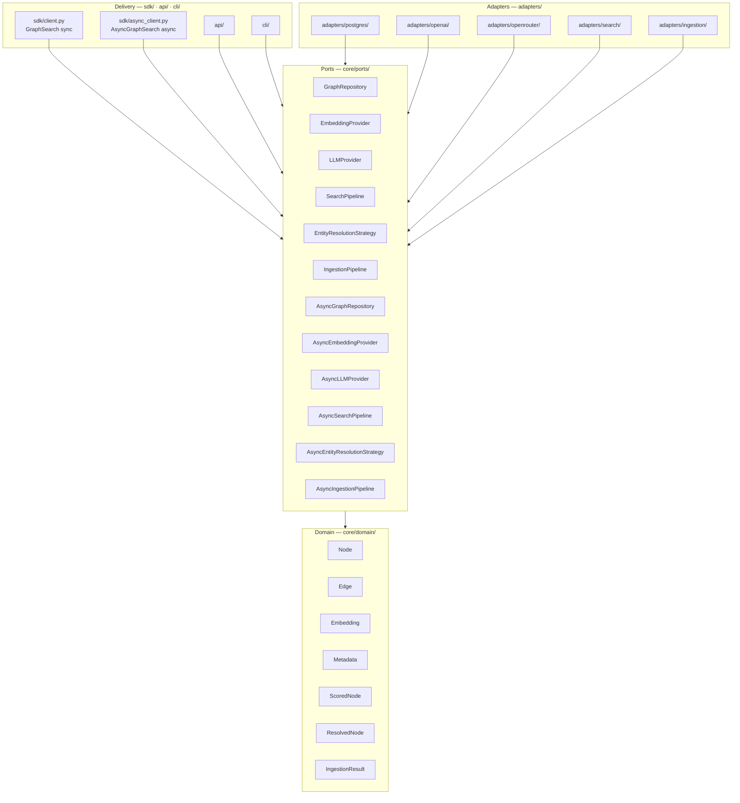

# Architecture Layers

> Clean Architecture layer-to-package mapping: where every concept lives in the codebase.

## Overview

depth-graph-search follows Clean Architecture with four layers. Each layer has a strict ownership over a set of Python packages. Crossing layers is explicit — always via ports. This document maps each layer to its concrete directory path and explains what lives there.

## Layer → Package Mapping



| Layer | Python Package | Imports From |
|-------|---------------|--------------|
| **Domain** | `core/domain/` | — (nothing external) |
| **Ports** | `core/ports/` | `core/domain/` only |
| **Adapters** | `adapters/` | `core/ports/`, `core/domain/`, third-party libs |
| **Delivery — SDK** | `sdk/` | `core/ports/`, `core/domain/` |
| **Delivery — API** | `api/` | `core/ports/`, `core/domain/` |
| **Delivery — CLI** | `cli/` | `core/ports/`, `core/domain/` |

> **v0.1 scope**: Directory structure, domain entities, and port contracts are fully implemented. `adapters/postgres/` is fully implemented (SDD-02, SDD-07 async). `adapters/openai/` and `adapters/openrouter/` are fully implemented with both sync and async variants (SDD-03, SDD-07). `adapters/search/` is fully implemented (SDD-04, SDD-07 async). `adapters/ingestion/` is fully implemented (SDD-05, SDD-07 async). **SDK delivery surface** (`sdk/`) ships both `GraphSearch` (sync, SDD-06) and `AsyncGraphSearch` (async, SDD-07). `api/` and `cli/` are stubbed — deferred to future SDDs.

## Domain Entities

The domain layer defines seven entity types. They carry no database or HTTP logic — they are plain data containers implemented as `@dataclass(frozen=True)` with zero external dependencies.

| Entity | Type | Description |
|--------|------|-------------|
| **Node** | `@dataclass(frozen=True)` | A concept or entity extracted from ingested text. Holds content, an optional embedding vector, and arbitrary metadata. Auto-generates a UUID4 `id` at construction. |
| **Edge** | `@dataclass(frozen=True)` | A directed relationship between two Nodes. Carries a relationship type label extracted by the LLM. Auto-generates a UUID4 `id`. |
| **Embedding** | `@dataclass(frozen=True)` | A dense vector (`list[float]`) with its source model and dimension count. No numpy dependency. |
| **Metadata** | `TypeAlias = dict[str, Any]` | Free-form key-value pairs attached to a Node at ingestion time. No fixed schema — any JSON-serializable dict is valid. |
| **ScoredNode** | `@dataclass(frozen=True)` | Output of a search — wraps `(node: Node, score: float, distance: int)`. Results ordered by score descending, distance ascending. |
| **ResolvedNode** | `@dataclass(frozen=True)` | Output of entity resolution — wraps `(node: Node, is_new: bool, matched_id: str \| None)`. Marks whether the node matched an existing graph entry. |
| **IngestionResult** | `@dataclass(frozen=True)` | Output of an ingestion run — wraps `(node_count: int, edge_count: int)`. Reusable across SDK, API, and CLI layers. Added in SDD-05. |

Domain entities are immutable — `frozen=True` enforces this at runtime. Adapters may persist them but never mutate their fields. The domain generates all entity IDs (uuid4) — databases never assign IDs.

## Adapters

Adapters are the only layer that talks to the outside world. Each adapter implements one or more ports.

**Sync Adapters:**

| Adapter | Port(s) Implemented | Technology | Status |
|---------|-------------------|------------|--------|
| `PostgresGraphRepository` | `GraphRepository` | PostgreSQL 17 + Apache AGE 1.6 + pgvector | ✅ Implemented (SDD-02) |
| `OpenAIProvider` | `EmbeddingProvider`, `LLMProvider` | OpenAI API | ✅ Implemented (SDD-03) |
| `OpenRouterProvider` | `LLMProvider` | OpenRouter API | ✅ Implemented (SDD-03) |
| `DefaultSearchPipeline` | `SearchPipeline` | Pure Python Orchestrator | ✅ Implemented (SDD-04) |
| `DefaultEntityResolutionStrategy` | `EntityResolutionStrategy` | Pure Python Orchestrator | ✅ Implemented (SDD-04) |
| `DefaultIngestionPipeline` | `IngestionPipeline` | Pure Python Orchestrator | ✅ Implemented (SDD-05) |

**Async Adapters (SDD-07):**

| Adapter | Port(s) Implemented | Technology | Status |
|---------|-------------------|------------|--------|
| `AsyncPostgresGraphRepository` | `AsyncGraphRepository` | psycopg.AsyncConnection + pgvector async | ✅ Implemented (SDD-07) |
| `AsyncOpenAIProvider` | `AsyncEmbeddingProvider`, `AsyncLLMProvider` | openai.AsyncOpenAI | ✅ Implemented (SDD-07) |
| `AsyncOpenRouterProvider` | `AsyncLLMProvider` | openai.AsyncOpenAI + OpenRouter base_url | ✅ Implemented (SDD-07) |
| `AsyncDefaultSearchPipeline` | `AsyncSearchPipeline` | Pure Python Async Orchestrator | ✅ Implemented (SDD-07) |
| `AsyncDefaultEntityResolutionStrategy` | `AsyncEntityResolutionStrategy` | Pure Python Async Orchestrator | ✅ Implemented (SDD-07) |
| `AsyncDefaultIngestionPipeline` | `AsyncIngestionPipeline` | Pure Python Async Orchestrator | ✅ Implemented (SDD-07) |

**`PostgresGraphRepository`** lives in `src/depth_graph_search/adapters/postgres/`. It uses dual-write: SQL `nodes` table (content, embedding, metadata, full-text search) + AGE graph (topology). The Docker dev stack (`Dockerfile.dev`, `docker-compose.yml`, `docker-init.sql`) provides a ready-to-use PostgreSQL 17 + AGE + pgvector environment.

**`OpenAIProvider`** lives in `src/depth_graph_search/adapters/openai/`. Single class implementing both `EmbeddingProvider` and `LLMProvider`. Uses the `openai` SDK with Structured Outputs (`.parse()`) for entity extraction. Dependencies: `openai>=1.0`, `pydantic>=2.0`.

**`OpenRouterProvider`** lives in `src/depth_graph_search/adapters/openrouter/`. Implements `LLMProvider` only (no embeddings). Uses the `openai` SDK with `base_url="https://openrouter.ai/api/v1"` and `json_object` response format for extraction.

**`DefaultSearchPipeline`** lives in `src/depth_graph_search/adapters/search/`. Implements `SearchPipeline`. Pure Python orchestrator — no external dependencies. Five-step algorithm: embed query → hybrid search → BFS expand → dedup by node ID → score and sort. Rank-score formula: `1.0 - rank / (top_n + 1)`. BFS-only nodes score `0.0`. Errors from injected ports propagate unmodified.

**`DefaultEntityResolutionStrategy`** lives in `src/depth_graph_search/adapters/search/`. Implements `EntityResolutionStrategy`. Pure Python — wraps a `SearchPipeline` (the ABC, not the concrete class). For each input node, searches with `top_n=1, depth_m=0`. Score `>= threshold` → existing match; otherwise → new entity. `len(result) == len(nodes)` always holds.

**`DefaultIngestionPipeline`** lives in `src/depth_graph_search/adapters/ingestion/`. Implements `IngestionPipeline`. Pure Python orchestrator — no external dependencies. Four-stage algorithm: validate input → LLM extract graph → embed node content → entity resolve + edge rewire → persist new nodes + all edges → return `IngestionResult`. All port errors (`LLMError`, `StorageError`) are wrapped as `IngestionError` with `__cause__` set. `dataclasses.replace()` is used for embedding attachment and edge rewiring (frozen dataclasses). Entity resolution uses an `id_map` dict for O(E) edge rewiring.

**Rule**: A new integration (e.g., a Pinecone vector store) is added by creating a new adapter under `adapters/` that implements the relevant port. Core code is never modified.

## Delivery Surfaces

The three delivery surfaces are thin entry points. They wire dependencies (inject adapters into ports) and delegate all logic to the core.

| Surface | Package | Consumer | How it Works |
|---------|---------|----------|--------------|
| **SDK** | `sdk/` | Python developers | Importable library. Use `GraphSearch` as the high-level entry point. |
| **HTTP API** | `api/` | Any HTTP client | REST service wrapping the SDK surface. |
| **CLI** | `cli/` | Terminal users | Command-line interface. Reads args, calls core, prints output. |

All three surfaces share the same core — there is no separate business logic per surface.

> **v0.1 scope**: All three surfaces are specified here. v0.1 implementation priority: SDK first, then API, then CLI.

## SDK Delivery Surfaces

### `GraphSearch` — Sync Facade (SDD-06)

`GraphSearch` is the sync public entry point for the SDK. It is a **pure wiring layer** — no business logic, all delegation to internal pipelines.

```python
from depth_graph_search import GraphSearch

with GraphSearch.from_openai("postgresql://...", "sk-...") as gs:
    result = gs.ingest("Alice works at Acme Corp.", metadata={"source": "wiki"})
    nodes = gs.search("who works at Acme?", top_n=5, depth_m=2)
```

**Classmethods**: `from_openai(dsn, api_key, *, model, embedding_model, graph_name, embedding_dimensions)` and `from_openrouter(dsn, openai_api_key, openrouter_api_key, *, ...)` handle connection creation, `repo.initialize()`, and provider wiring. The facade owns the connection lifecycle.

**Internal wiring**:
1. `_search_pipeline = DefaultSearchPipeline(graph_repository, embedding_provider)`
2. `_entity_resolution = DefaultEntityResolutionStrategy(_search_pipeline)` ← auto-built when `entity_resolution=None`
3. `_ingestion_pipeline = DefaultIngestionPipeline(llm_provider, embedding_provider, graph_repository, entity_resolution)`

### `AsyncGraphSearch` — Async Facade (SDD-07)

`AsyncGraphSearch` is the async-native public entry point. It mirrors `GraphSearch` exactly, but every I/O method is `async def`. Constructors are sync (no I/O). Factory classmethods are `async classmethod` (they call `await repo.initialize()`).

```python
from depth_graph_search import AsyncGraphSearch

async with await AsyncGraphSearch.from_openai("postgresql://...", "sk-...") as gs:
    await gs.ingest("Alice works at Acme Corp.", metadata={"source": "wiki"})
    nodes = await gs.search("who works at Acme?", top_n=5, depth_m=2)
```

**Key design facts**:
- `__init__` is synchronous — accepts pre-built async ports via dependency injection; no I/O
- `from_openai` / `from_openrouter` are `async classmethod` — must be awaited; call `await repo.initialize()` internally
- `__aenter__` returns `self`; `__aexit__` awaits `close()`
- All async adapters are sibling files next to their sync counterparts (`async_*.py`)
- No inheritance between sync and async ABCs — parallel, independent interfaces

**Internal wiring**:
1. `_search_pipeline = AsyncDefaultSearchPipeline(async_repository, async_embedding_provider)`
2. `_entity_resolution = AsyncDefaultEntityResolutionStrategy(_search_pipeline)`
3. `_ingestion_pipeline = AsyncDefaultIngestionPipeline(async_llm_provider, async_embedding_provider, async_repository, _entity_resolution)`

## See Also

- [Overview](./overview.md) — system boundary diagram and dependency rule
- [Ports & Adapters](./ports-and-adapters.md) — full interface contracts for each port
- [Functional Requirements](../requirements/functional.md) — what each layer must deliver
- [Strategies](./strategies.md) — how the Strategy Pattern extends across adapters
