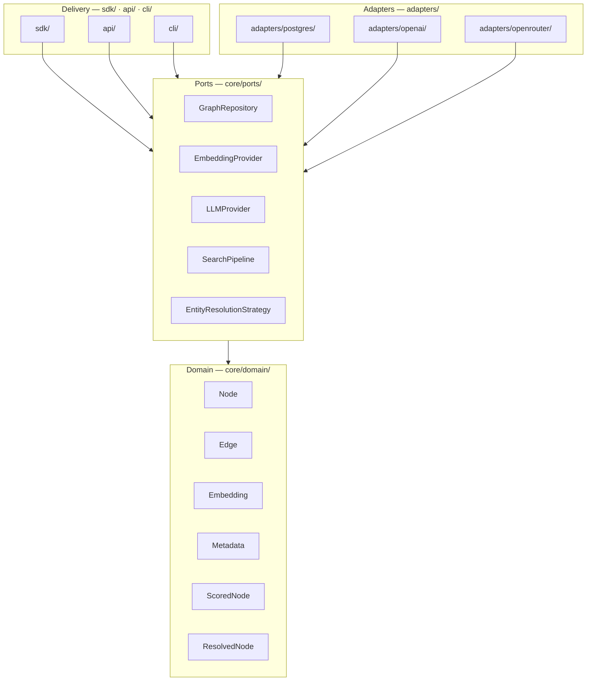

# Architecture Layers

> Clean Architecture layer-to-package mapping: where every concept lives in the codebase.

## Overview

depth-graph-search follows Clean Architecture with four layers. Each layer has a strict ownership over a set of Python packages. Crossing layers is explicit — always via ports. This document maps each layer to its concrete directory path and explains what lives there.

## Layer → Package Mapping

| Layer | Python Package | Imports From |
|-------|---------------|--------------|
| **Domain** | `core/domain/` | — (nothing external) |
| **Ports** | `core/ports/` | `core/domain/` only |
| **Adapters** | `adapters/` | `core/ports/`, `core/domain/`, third-party libs |
| **Delivery — SDK** | `sdk/` | `core/ports/`, `core/domain/` |
| **Delivery — API** | `api/` | `core/ports/`, `core/domain/` |
| **Delivery — CLI** | `cli/` | `core/ports/`, `core/domain/` |

> **v0.1 scope**: Directory structure, domain entities, and port contracts are fully implemented. `adapters/postgres/` is fully implemented (SDD-02). `adapters/openai/` and `adapters/openrouter/` are fully implemented (SDD-03). Delivery surfaces (`sdk/`, `api/`, `cli/`) are stubbed — deferred to SDD-06+.

## Domain Entities

The domain layer defines six entity types. They carry no database or HTTP logic — they are plain data containers implemented as `@dataclass(frozen=True)` with zero external dependencies.

| Entity | Type | Description |
|--------|------|-------------|
| **Node** | `@dataclass(frozen=True)` | A concept or entity extracted from ingested text. Holds content, an optional embedding vector, and arbitrary metadata. Auto-generates a UUID4 `id` at construction. |
| **Edge** | `@dataclass(frozen=True)` | A directed relationship between two Nodes. Carries a relationship type label extracted by the LLM. Auto-generates a UUID4 `id`. |
| **Embedding** | `@dataclass(frozen=True)` | A dense vector (`list[float]`) with its source model and dimension count. No numpy dependency. |
| **Metadata** | `TypeAlias = dict[str, Any]` | Free-form key-value pairs attached to a Node at ingestion time. No fixed schema — any JSON-serializable dict is valid. |
| **ScoredNode** | `@dataclass(frozen=True)` | Output of a search — wraps `(node: Node, score: float, distance: int)`. Results ordered by score descending, distance ascending. |
| **ResolvedNode** | `@dataclass(frozen=True)` | Output of entity resolution — wraps `(node: Node, is_new: bool, matched_id: str \| None)`. Marks whether the node matched an existing graph entry. |

Domain entities are immutable — `frozen=True` enforces this at runtime. Adapters may persist them but never mutate their fields. The domain generates all entity IDs (uuid4) — databases never assign IDs.

## Adapters

Adapters are the only layer that talks to the outside world. Each adapter implements one or more ports.

| Adapter | Port(s) Implemented | Technology | Status |
|---------|-------------------|------------|--------|
| `PostgresGraphRepository` | `GraphRepository` | PostgreSQL 17 + Apache AGE 1.6 + pgvector | ✅ Implemented (SDD-02) |
| `OpenAIProvider` | `EmbeddingProvider`, `LLMProvider` | OpenAI API | ✅ Implemented (SDD-03) |
| `OpenRouterProvider` | `LLMProvider` | OpenRouter API | ✅ Implemented (SDD-03) |

**`PostgresGraphRepository`** lives in `src/depth_graph_search/adapters/postgres/`. It uses dual-write: SQL `nodes` table (content, embedding, metadata, full-text search) + AGE graph (topology). The Docker dev stack (`Dockerfile.dev`, `docker-compose.yml`, `docker-init.sql`) provides a ready-to-use PostgreSQL 17 + AGE + pgvector environment.

**`OpenAIProvider`** lives in `src/depth_graph_search/adapters/openai/`. Single class implementing both `EmbeddingProvider` and `LLMProvider`. Uses the `openai` SDK with Structured Outputs (`.parse()`) for entity extraction. Dependencies: `openai>=1.0`, `pydantic>=2.0`.

**`OpenRouterProvider`** lives in `src/depth_graph_search/adapters/openrouter/`. Implements `LLMProvider` only (no embeddings). Uses the `openai` SDK with `base_url="https://openrouter.ai/api/v1"` and `json_object` response format for extraction.

**Rule**: A new integration (e.g., a Pinecone vector store) is added by creating a new adapter under `adapters/` that implements the relevant port. Core code is never modified.

## Delivery Surfaces

The three delivery surfaces are thin entry points. They wire dependencies (inject adapters into ports) and delegate all logic to the core.

| Surface | Package | Consumer | How it Works |
|---------|---------|----------|--------------|
| **SDK** | `sdk/` | Python developers | Importable library. Caller instantiates and calls directly. |
| **HTTP API** | `api/` | Any HTTP client | REST service wrapping the SDK surface. |
| **CLI** | `cli/` | Terminal users | Command-line interface. Reads args, calls core, prints output. |

All three surfaces share the same core — there is no separate business logic per surface.

> **v0.1 scope**: All three surfaces are specified here. v0.1 implementation priority: SDK first, then API, then CLI.

## See Also

- [Overview](./overview.md) — system boundary diagram and dependency rule
- [Ports & Adapters](./ports-and-adapters.md) — full interface contracts for each port
- [Functional Requirements](../requirements/functional.md) — what each layer must deliver
- [Strategies](./strategies.md) — how the Strategy Pattern extends across adapters
