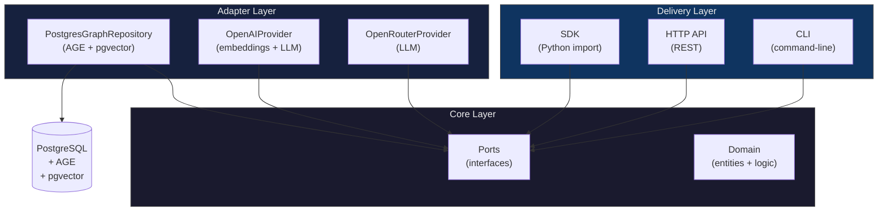

# Architecture Overview

> The 30,000-ft view: system boundaries, layer dependencies, and v0.1 scope.

## Overview

depth-graph-search is a RAG library that combines hybrid vector search with graph traversal. It is built on Clean Architecture: a dependency-free core surrounded by swappable adapters. All persistence runs through a single PostgreSQL connection (relational + pgvector + AGE).

The system exposes three delivery surfaces — SDK, HTTP API, and CLI — all sharing the same core.

## System Boundaries

**Dependency rule**: Core (`core/domain/`, `core/ports/`) imports ZERO adapter code. All dependencies point inward — adapters depend on ports, not the other way around.

## Clean Architecture Layers

| Layer | Responsibility | Allowed Imports |
|-------|---------------|-----------------|
| **Domain** | Entities, value objects, pure logic | Nothing — zero external deps |
| **Ports** | Abstract interfaces for I/O | Domain only |
| **Adapters** | Concrete implementations of ports | Ports, Domain, external libs |
| **Delivery** | Entry points (SDK, API, CLI) | Ports, Domain, Adapters |

The dependency rule is enforced by convention in v0.1 (no import linter yet). Any PR that makes `core/` import from `adapters/` is a hard reject.

## v0.1 Scope

> **v0.1 scope**: This release establishes the architecture documentation. No production code is shipped yet. The docs below define the contracts that code must satisfy.

**Included in v0.1 documentation:**
- 4 architecture docs (overview, layers, ports-and-adapters, strategies)
- 1 decision record (ADR-001: PostgreSQL + AGE)
- 2 requirements docs (functional FR-01–FR-09, non-functional)
- 2 flow docs (ingestion, search)

**Explicitly excluded from v0.1:**
- Source code implementation
- Packaging / PyPI distribution
- Performance benchmarks or SLAs
- Authentication / authorization
- Multi-tenancy

## Reading Guide

Read the docs in this order for progressive disclosure:

1. **You are here** — system shape and boundaries
2. [Layers](./layers.md) — package-level mapping of Clean Architecture
3. [Ports & Adapters](./ports-and-adapters.md) — every interface contract
4. [Strategies](./strategies.md) — the four-level Strategy Pattern
5. [ADR-001](./decisions/ADR-001-postgresql-age.md) — why PostgreSQL + AGE
6. [Functional Requirements](../requirements/functional.md) — FR-01 through FR-09
7. [Non-Functional Requirements](../requirements/non-functional.md) — quality constraints
8. [Ingestion Flow](../flows/ingestion.md) — runtime: text → graph
9. [Search Flow](../flows/search.md) — runtime: query → results

## See Also

- [Layers](./layers.md) — package-to-layer mapping
- [Ports & Adapters](./ports-and-adapters.md) — interface contracts
- [Strategies](./strategies.md) — Strategy Pattern at four levels
- [ADR-001: PostgreSQL + AGE](./decisions/ADR-001-postgresql-age.md) — technology decision record
