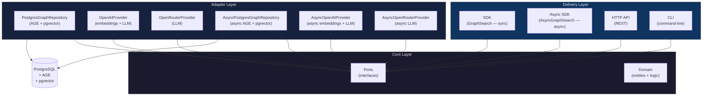

# Architecture Overview

> The 30,000-ft view: system boundaries, layer dependencies, and v0.1 scope.

## Overview

depth-graph-search is a RAG library that combines hybrid vector search with graph traversal. It is built on Clean Architecture: a dependency-free core surrounded by swappable adapters. All persistence runs through a single PostgreSQL connection (relational + pgvector + AGE).

The system exposes three delivery surfaces — SDK, HTTP API, and CLI — all sharing the same core. Both **synchronous** (`GraphSearch`) and **async-native** (`AsyncGraphSearch`) facades are available, making the SDK fully usable from FastAPI, asyncio-native applications, and any async Python runtime.

## System Boundaries

**Dependency rule**: Core (`core/domain/`, `core/ports/`) imports ZERO adapter code. All dependencies point inward — adapters depend on ports, not the other way around.

## Clean Architecture Layers

| Layer | Responsibility | Allowed Imports |
|-------|---------------|-----------------|
| **Domain** | Entities, value objects, pure logic | Nothing — zero external deps |
| **Ports** | Abstract interfaces for I/O | Domain only |
| **Adapters** | Concrete implementations of ports | Ports, Domain, external libs |
| **Delivery** | Entry points (SDK, API, CLI) | Ports, Domain, Adapters |

The dependency rule is enforced by convention in v0.1 (no import linter yet). Any PR that makes `core/` import from `adapters/` is a hard reject.

## v0.1 Scope

> **v0.1 scope**: Architecture, domain, all 6 sync ports + 6 async ports, all sync and async adapters, both SDK delivery surfaces (`GraphSearch` + `AsyncGraphSearch`), the HTTP API delivery surface, and the CLI delivery surface are all fully implemented. The ingestion and search pipelines are production-ready in both sync and async variants.

**Implemented in v0.1:**
- 4 architecture docs (overview, layers, ports-and-adapters, strategies)
- 10 decision records (ADR-001 through ADR-010)
- 2 requirements docs (functional FR-01–FR-11, non-functional)
- 2 flow docs (ingestion, search)
- Domain layer: `Node`, `Edge`, `Embedding`, `Metadata`, `ScoredNode`, `ResolvedNode`, `IngestionResult` (SDD-01, SDD-05)
- All 6 sync port ABCs: `GraphRepository`, `EmbeddingProvider`, `LLMProvider`, `SearchPipeline`, `EntityResolutionStrategy`, `IngestionPipeline` (SDD-01 through SDD-05)
- All 6 async port ABCs + `health_check()` on `AsyncGraphRepository`: `AsyncGraphRepository`, `AsyncEmbeddingProvider`, `AsyncLLMProvider`, `AsyncSearchPipeline`, `AsyncEntityResolutionStrategy`, `AsyncIngestionPipeline` — parallel independent interfaces (SDD-07, SDD-08)
- All sync adapters: `PostgresGraphRepository`, `OpenAIProvider`, `OpenRouterProvider`, `DefaultSearchPipeline`, `DefaultEntityResolutionStrategy`, `DefaultIngestionPipeline` (SDD-02 through SDD-05)
- All async adapters: `AsyncPostgresGraphRepository`, `AsyncOpenAIProvider`, `AsyncOpenRouterProvider`, `AsyncDefaultSearchPipeline`, `AsyncDefaultEntityResolutionStrategy`, `AsyncDefaultIngestionPipeline` (SDD-07)
- Sync SDK delivery surface: `GraphSearch` facade wiring all 6 sync ports into `ingest()` / `search()` with `from_openai` / `from_openrouter` classmethods (SDD-06)
- Async SDK delivery surface: `AsyncGraphSearch` facade wiring all 6 async ports into `await gs.ingest()` / `await gs.search()` with `async with await AsyncGraphSearch.from_openai(...)` (SDD-07); parity fixed — both return `IngestionResult` / `list[ScoredNode]` (SDD-08)
- HTTP API delivery surface: FastAPI `create_app()` factory, `POST /ingest`, `POST /search`, `GET /health`, pydantic-settings `Settings`, Docker container (SDD-08)
- CLI delivery surface: `dgs` Typer app with `ingest`, `search`, `version` commands; `CLISettings(BaseSettings)` for env-var config; `format_ingest_result` / `format_search_results` formatters for json/table/plain output; installable as `pip install "depth-graph-search[cli]"` (SDD-09)
- Reusable test mock adapters: `InMemoryGraphRepository`, `FakeLLMProvider`, `FakeEmbeddingProvider`, `FakeEntityResolutionStrategy` in `tests/mocks/` (SDD-05)
- 454 tests passing (454 unit; 362 pre-existing + 92 CLI from SDD-09)

**Explicitly excluded from v0.1:**
- Packaging / PyPI distribution
- Performance benchmarks or SLAs
- Authentication / authorization
- Multi-tenancy
- `asyncio.gather` optimizations in async pipelines (future SDD)
- Connection pooling (future SDD)
- CI packaging test for CLI (`pip install "depth-graph-search[cli]"` → `dgs --version` in clean venv — future SDD)

## Reading Guide

Read the docs in this order for progressive disclosure:

1. **You are here** — system shape and boundaries
2. [Layers](./layers.md) — package-level mapping of Clean Architecture
3. [Ports & Adapters](./ports-and-adapters.md) — every interface contract
4. [Strategies](./strategies.md) — the four-level Strategy Pattern
5. [ADR-001](./decisions/ADR-001-postgresql-age.md) — why PostgreSQL + AGE
6. [ADR-002](./decisions/ADR-002-clean-architecture.md) — frozen dataclasses + ABC ports
7. [ADR-003](./decisions/ADR-003-dual-llm-providers.md) — dual LLM provider strategy
8. [ADR-004](./decisions/ADR-004-hybrid-search-pipeline.md) — hybrid search pipeline
9. [ADR-005](./decisions/ADR-005-ingestion-pipeline.md) — ingestion pipeline
10. [ADR-006](./decisions/ADR-006-sdk-facade.md) — SDK facade
11. [ADR-007](./decisions/ADR-007-async-architecture.md) — mirrored sync/async
12. [ADR-008](./decisions/ADR-008-http-api.md) — HTTP API with FastAPI
13. [ADR-009](./decisions/ADR-009-cli-interface.md) — CLI with Typer
14. [ADR-010](./decisions/ADR-010-openrouter-embeddings.md) — optional OpenAI via OpenRouter embeddings
15. [Functional Requirements](../requirements/functional.md) — FR-01 through FR-09
7. [Non-Functional Requirements](../requirements/non-functional.md) — quality constraints
8. [Ingestion Flow](../flows/ingestion.md) — runtime: text → graph
9. [Search Flow](../flows/search.md) — runtime: query → results

## See Also

- [Layers](./layers.md) — package-to-layer mapping
- [Ports & Adapters](./ports-and-adapters.md) — interface contracts
- [Strategies](./strategies.md) — Strategy Pattern at four levels
- [ADR-001: PostgreSQL + AGE](./decisions/ADR-001-postgresql-age.md) — technology decision record
- [ADR-002: Clean Architecture](./decisions/ADR-002-clean-architecture.md) — frozen dataclasses + ABC ports
- [ADR-003: Dual LLM Providers](./decisions/ADR-003-dual-llm-providers.md) — OpenAI + OpenRouter strategy
- [ADR-004: Hybrid Search Pipeline](./decisions/ADR-004-hybrid-search-pipeline.md) — BM25 + vector + BFS
- [ADR-005: Ingestion Pipeline](./decisions/ADR-005-ingestion-pipeline.md) — LLM extraction + entity resolution
- [ADR-006: SDK Facade](./decisions/ADR-006-sdk-facade.md) — port injection + factory classmethods
- [ADR-007: Mirrored Sync/Async](./decisions/ADR-007-async-architecture.md) — full async mirror architecture
- [ADR-008: HTTP API](./decisions/ADR-008-http-api.md) — FastAPI + pydantic-settings + lifespan
- [ADR-009: CLI Interface](./decisions/ADR-009-cli-interface.md) — Typer + Rich thin adapter
- [ADR-010: OpenRouter Embeddings](./decisions/ADR-010-openrouter-embeddings.md) — optional OpenAI via OpenRouter
