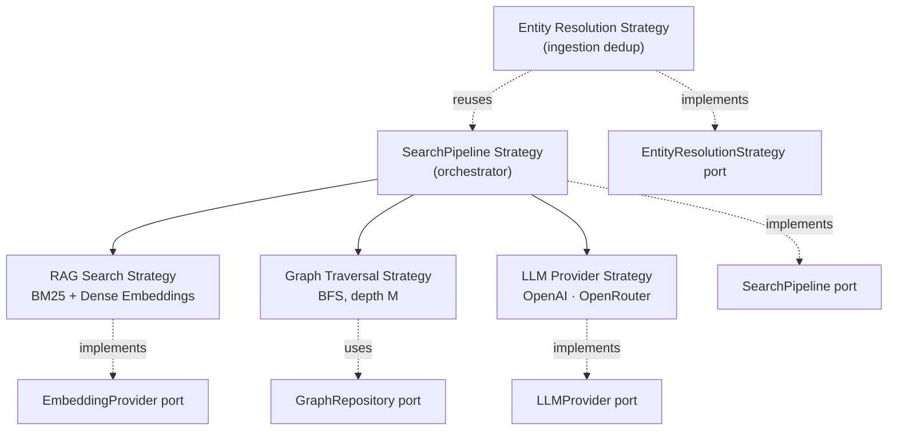
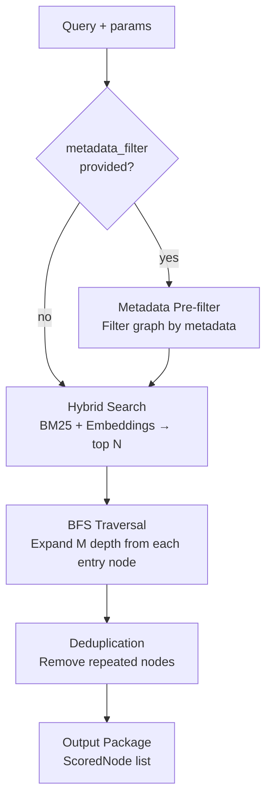

# Strategies

> The Strategy Pattern at five levels — including the pipeline as a strategy of strategies.

## Overview

depth-graph-search applies the Strategy Pattern at five distinct levels. Each level defines a swappable algorithm behind a port interface. The highest level — the Search Pipeline Strategy — orchestrates the search flow, making the entire sequence replaceable without modifying core code. A fifth level — Entity Resolution — applies during ingestion to prevent duplicate entities in the graph.

v0.1 ships one concrete strategy per level. New strategies can be registered and passed at call time.

## Strategy Hierarchy



## Level 1 — RAG Search Strategy

**What it does**: Given a query, produce the top N most relevant nodes using hybrid search.

**v0.1 default**: BM25 (full-text) + dense vector similarity (pgvector cosine distance). Both signals are combined; the merged score determines ranking.

| Property | Value |
|----------|-------|
| Port | `EmbeddingProvider` (for query embedding) + `GraphRepository.search_hybrid` |
| v0.1 Algorithm | BM25 + cosine similarity via pgvector |
| Configurable parameter | `top_n` — number of results returned |
| Extension point | Implement a new `GraphRepository` that uses a different scoring strategy |

> **v0.1 scope**: Re-ranking, cross-encoder scoring, and sparse-dense fusion weights are not implemented. The default hybrid search is unweighted.

## Level 2 — Graph Traversal Strategy

**What it does**: Starting from each of the top N entry nodes, expand the graph outward up to M depth levels. Collect and deduplicate all reachable nodes.

**v0.1 default**: Breadth-First Search (BFS) adjacency expansion, configurable depth M, global deduplication by node ID.

| Property | Value |
|----------|-------|
| Port | `GraphRepository.traverse_bfs` |
| v0.1 Algorithm | BFS from each entry node, depth M |
| Configurable parameters | `depth_m` — expansion depth per entry node |
| Extension point | Implement a custom traversal method in a `GraphRepository` subport |

**Deduplication rule**: A node visited from multiple entry nodes is included once. The score used is from the first time the node is encountered (by BFS order).

> **v0.1 scope**: DFS, Dijkstra, and personalized PageRank traversal are not included. BFS is the sole traversal algorithm.

## Level 3 — LLM Provider Strategy

**What it does**: Extract structured graph elements (nodes + edges) from raw text during ingestion, and generate embeddings for nodes.

**v0.1 default**: Two providers — both capable of embeddings and LLM extraction. Three runtime configurations are supported: OpenAI-only, OpenRouter-only (no OpenAI key needed), and Mixed (OpenAI for embeddings + OpenRouter for LLM).

| Provider | Port | Primary Use |
|----------|------|-------------|
| `OpenAIProvider` | `LLMProvider` + `EmbeddingProvider` | Entity/edge extraction + embeddings |
| `OpenRouterProvider` | `LLMProvider` + `EmbeddingProvider` | Entity/edge extraction + embeddings (via OpenRouter API) |

| Property | Value |
|----------|-------|
| Port | `LLMProvider`, `EmbeddingProvider` |
| v0.1 Providers | OpenAI, OpenRouter |
| Extension point | Implement `LLMProvider` or `EmbeddingProvider` for any new provider |

> **v0.1 scope**: Provider selection is configured at initialization time (not per-call). Dynamic per-query provider routing is not implemented.

## Level 4 — Search Pipeline Strategy

**What it does**: Orchestrates the complete search flow. The pipeline is itself a strategy — the entire sequence of steps is swappable at call time.

This is the "strategy of strategies": the pipeline decides which RAG strategy, traversal strategy, and LLM provider to invoke, and in what order.

### Default Pipeline Sequence



**Step-by-step**:

| Step | Action | Input | Output | Optional? |
|------|--------|-------|--------|-----------|
| 1 | Metadata pre-filter | `metadata_filter` dict | Filtered node set | Yes — skipped if `metadata_filter` is `None` |
| 2 | Hybrid search | Query string + filtered set | Top N nodes (entry nodes) | No |
| 3 | BFS traversal | Entry nodes + `depth_m` | Expanded node set | No |
| 4 | Deduplication | Expanded set | Unique nodes | No |
| 5 | Output packaging | Unique nodes | `list[ScoredNode]` | No |

### Custom Pipeline Extension

A custom pipeline implements the `SearchPipeline` port and is passed by name at search time:

```
# Pseudo-code — not Python implementation
class MyDFSPipeline implements SearchPipeline:
    def search(query, top_n, depth_m, metadata_filter, pipeline):
        nodes = graph_repo.search_hybrid(query, top_n, metadata_filter)
        expanded = graph_repo.traverse_dfs(nodes, depth_m)   # custom traversal
        return deduplicate(expanded)

# Caller selects pipeline at search time:
results = search(query="...", pipeline="my-dfs-pipeline")
```

**Registration**: Custom pipelines are registered at application initialization by injecting them into the delivery surface's dependency container. The `pipeline` parameter in `SearchPipeline.search()` resolves to the registered implementation.

> **v0.1 scope**: `DefaultSearchPipeline` is implemented (SDD-04). The pipeline registry (named strategy lookup) is NOT yet implemented — `pipeline` parameter is accepted but silently ignored if any value other than `None` is passed. v0.1 ships one pipeline: `"default"`. Custom pipeline authoring requires code contribution.

## Level 5 — Entity Resolution Strategy

**What it does**: During ingestion, searches the existing graph for entities that match newly extracted nodes. Prevents duplicate representations of the same real-world entity.

**v0.1 default**: Reuses the search pipeline (BM25 + embedding similarity) to find candidate matches. If a candidate exceeds a configurable similarity threshold, the existing node is reused instead of creating a duplicate.

| Property | Value |
|----------|-------|
| Port | `EntityResolutionStrategy` |
| v0.1 Algorithm | Reuses hybrid search pipeline for candidate matching |
| Configurable parameter | Similarity threshold for match acceptance |
| Extension point | Implement a custom `EntityResolutionStrategy` (exact name match, fuzzy, ML-based, domain-specific) |

**Why it reuses search**: The search engine is already optimized for finding similar nodes. Using it for entity resolution avoids duplicating retrieval logic and ensures consistency — the same algorithm that finds relevant nodes for queries also detects duplicates during ingestion.

> **v0.1 scope**: `DefaultEntityResolutionStrategy` is implemented (SDD-04). Entity resolution is best-effort. False negatives (missed duplicates) are possible. The similarity threshold is configurable but not auto-tuned. Custom strategies can improve precision for specific domains.

## See Also

- [Ports & Adapters](./ports-and-adapters.md) — the port definitions each strategy implements
- [Layers](./layers.md) — where each strategy class lives in the package hierarchy
- [Search Flow](../flows/search.md) — runtime sequence for the default pipeline
- [Ingestion Flow](../flows/ingestion.md) — runtime sequence showing entity resolution step
