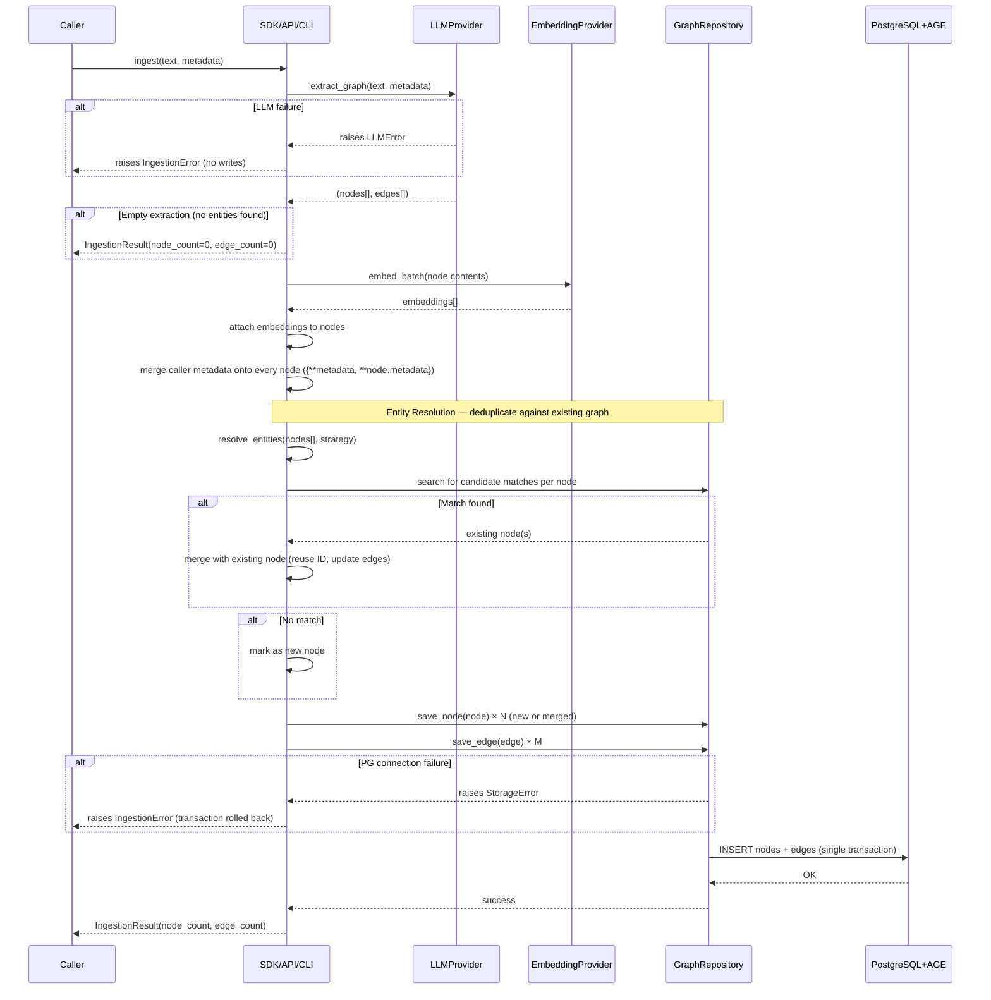

# Ingestion Flow

> Runtime sequence for ingesting raw text and metadata into the graph.

## Overview

Ingestion transforms free-form text and optional metadata into a graph structure stored in PostgreSQL. The process has four stages: LLM-based entity extraction, embedding generation, entity resolution (deduplication against existing graph), and graph persistence. All stages must succeed — there are no partial writes.

This flow applies to both the **sync** (`DefaultIngestionPipeline` / `GraphSearch`) and **async** (`AsyncDefaultIngestionPipeline` / `AsyncGraphSearch`) variants. The async variant mirrors this flow with `await` on every I/O call; the sequence and invariants are identical.

## Sequence Diagram



## Entity Resolution

Before persisting new nodes, the ingestion pipeline runs an **entity resolution** step to detect potential duplicates against the existing graph. This prevents the same real-world entity from being stored as multiple disconnected nodes.

**How it works**:

1. For each extracted node, the pipeline searches the existing graph for candidate matches using a configurable **EntityResolutionStrategy**.
2. If a match is found, the existing node is reused — new edges point to the existing node instead of creating a duplicate.
3. If no match is found, the node is inserted as new.

**Strategy Pattern**: Entity resolution uses the same Strategy Pattern as search. The default v0.1 strategy reuses the search pipeline (BM25 + embedding similarity) to find candidate matches. This avoids duplicating search logic — the engine uses itself to maintain graph quality.

| Property | Value |
|----------|-------|
| Port | `EntityResolutionStrategy` |
| v0.1 Algorithm | Reuses hybrid search (BM25 + embeddings) to find candidates |
| Configurable | Similarity threshold for match acceptance |
| Extension point | Implement a custom `EntityResolutionStrategy` (exact match, fuzzy, ML-based, etc.) |

> **v0.1 scope**: Entity resolution is best-effort, not infallible. The default strategy uses the existing search pipeline with a configurable similarity threshold. False negatives (missed duplicates) are possible. Custom strategies can improve precision for specific domains.

## Metadata Handling

Metadata in depth-graph-search is intentionally schema-free:

- **Format**: Arbitrary key-value pairs (`dict`). Any JSON-serializable value is accepted.
- **Storage**: Stored as `jsonb` on each Node in PostgreSQL. The graph schema imposes no field constraints.
- **At ingestion**: Metadata is passed to `LLMProvider.extract_graph()` as context. Additionally, the pipeline GUARANTEES that caller-supplied metadata is merged onto every node before persistence — `{**metadata, **node.metadata}`. Node-level metadata keys (set by the LLM adapter) take precedence over caller-supplied keys on conflict. This guarantee is enforced at the pipeline level, not delegated to the LLM adapter.
- **For pre-filtering**: Metadata is queryable after ingestion via `metadata_filter` in the search flow. See [Search Flow](./search.md) and [FR-02](../requirements/functional.md#fr-02--metadata-pre-filter).

**Example**:

```
# Valid metadata — no schema constraints
{"source": "paper-2024.pdf", "author": "Jane Doe", "year": 2024}
{"domain": "biology", "confidence": 0.92, "tags": ["cell", "receptor"]}
{}   # empty dict is valid — no metadata
```

> **v0.1 scope**: Metadata validation (required fields, type constraints) is not implemented. Any dict is accepted. Schema validation may be added as a configurable option in a later release.

## Error Paths

### Error Path 1 — LLM Failure

**Trigger**: `LLMProvider.extract_graph()` raises an exception (timeout, API error, rate limit, malformed response).

**Behavior**:
- The ingestion pipeline catches the error immediately
- No nodes or edges have been written to PostgreSQL at this point
- The error is surfaced to the caller as an `IngestionError` with the LLM failure as the cause
- The caller's text and metadata are not persisted anywhere

**Invariant**: LLM failure → zero writes to PG. The graph is never in a partial state.

### Error Path 2 — PostgreSQL Connection Failure

**Trigger**: `GraphRepository.save_node()` or `GraphRepository.save_edge()` raises a connection error.

**Behavior**:
- The active PostgreSQL transaction is rolled back
- Any nodes already written in the current batch are undone by the rollback
- The error is surfaced to the caller as an `IngestionError` with the storage failure as the cause

**Invariant**: PG failure → full transaction rollback. The graph is never in a partial state.

### Error Path 3 — Invalid Input

**Trigger**: Caller passes empty text (`""` or whitespace-only), or a `metadata` value that is not JSON-serializable.

**Behavior**:
- The SDK validates input before calling any port
- Validation failure raises a `ValidationError` immediately
- No LLM call is made, no PG write is attempted

**Invariant**: Invalid input is rejected at the SDK boundary. No downstream ports are called with invalid data.

## Async Ingestion

`AsyncDefaultIngestionPipeline` and `AsyncGraphSearch` implement the same flow with `await` on every I/O call:

```python
async with await AsyncGraphSearch.from_openai("postgresql://...", "sk-...") as gs:
    await gs.ingest("Alice works at Acme Corp.", metadata={"source": "wiki"})
```

Key async differences:
- `AsyncDefaultIngestionPipeline.ingest()` returns `None` (not `IngestionResult`) — simplified for v0.1
- Entity resolution uses sequential `await pipeline.search(entity)` — no `asyncio.gather`
- All error paths and invariants (zero writes on failure, metadata merge guarantee) are identical to the sync variant

## See Also

- [FR-01: Text Ingestion](../requirements/functional.md#fr-01--text-ingestion) — behavioral requirement for this flow
- [FR-02: Metadata Pre-filter](../requirements/functional.md#fr-02--metadata-pre-filter) — how ingested metadata is used in search
- [Ports & Adapters](../architecture/ports-and-adapters.md) — `LLMProvider`, `EmbeddingProvider`, `GraphRepository` contracts and async counterparts
- [Search Flow](./search.md) — the downstream flow that consumes ingested data
