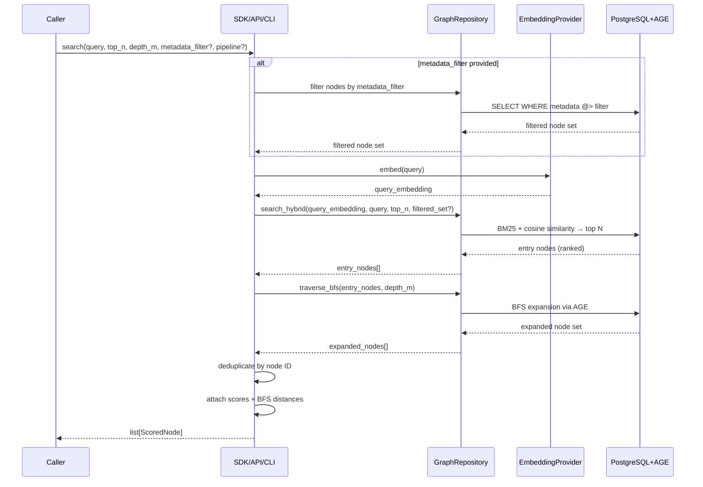

# Search Flow

> Runtime sequence for the default search pipeline: query → scored node package.

## Overview

Search in depth-graph-search runs in three sequential phases after an optional pre-filter. A metadata pre-filter narrows the graph, hybrid RAG (BM25 + dense embeddings) finds the most relevant entry nodes, and BFS traversal expands the graph outward from those nodes. The result is a deduplicated, scored package of nodes.

The pipeline itself is a strategy — callers can substitute a different pipeline at call time. Both **sync** (`DefaultSearchPipeline` / `GraphSearch`) and **async** (`AsyncDefaultSearchPipeline` / `AsyncGraphSearch`) variants are available.

## Sequence Diagram



## Search Parameters

| Parameter | Required | Default | Description |
|-----------|----------|---------|-------------|
| `query` | Yes | — | Search query string. Used for both BM25 and embedding generation. |
| `top_n` | No | configurable | Number of entry nodes returned by RAG. These entry nodes initiate the BFS traversal. |
| `depth_m` | No | configurable | BFS expansion depth from each entry node. Higher = broader context. |
| `metadata_filter` | No | `None` | Dict of key-value conditions. If provided, filters graph before RAG. |
| `pipeline` | No | `"default"` | Named pipeline strategy. Pass a registered alternate pipeline name to change the orchestration. |

`top_n` and `depth_m` defaults are configured at application initialization. Callers can override per-request.

## Edge Cases

### Edge Case 1 — Empty RAG Results

**Trigger**: The query embedding and BM25 text match no nodes above the similarity threshold, or the metadata pre-filter returns an empty set before RAG runs.

**Behavior**: The system returns an empty `list[ScoredNode]` — not an error. Empty results are a valid outcome.

**Rationale**: No matching nodes is a legitimate search result. Raising an exception would force every caller to wrap search in try/except for a normal business condition.

### Edge Case 2 — Metadata Filter Matches Zero Nodes

**Trigger**: `metadata_filter` is provided but no nodes in the graph have matching metadata.

**Behavior**:
1. The filter step returns an empty set
2. RAG receives an empty candidate set → returns zero entry nodes
3. BFS has no entry nodes → returns empty
4. Output: `[]` (empty list, no error)

Callers can distinguish this from "no semantic match" by checking if the filtered set is empty before passing it to RAG — but this is optional. The default behavior is: empty filter → empty result, no exception.

### Edge Case 3 — All BFS Results Are Duplicates

**Trigger**: Multiple top-N entry nodes share the same BFS neighborhood. Every expanded node is reachable from more than one entry node.

**Behavior**: Deduplication removes all repeated nodes. The output may be smaller than `top_n × depth expansion`. In the extreme case, all expansions overlap and the output is just the top-N entry nodes themselves (depth-0 set).

**Output invariant**: Every node in the output appears exactly once, regardless of how many paths lead to it.

## Output Format

The search result is a list of `ScoredNode` items. Each item contains:

| Field | Description |
|-------|-------------|
| `node` | The Node entity — content, metadata, embedding |
| `score` | Hybrid similarity score from the RAG phase (higher = more relevant to query) |
| `distance` | BFS hops from the nearest entry node (0 = entry node itself, 1 = direct neighbor, etc.) |

The list is ordered by: `score` descending, then `distance` ascending (closer nodes first at equal score).

Entry nodes (distance 0) always appear before BFS-expanded nodes of the same score. This ordering reflects semantic relevance first, structural proximity second.

> **v0.1 scope**: `DefaultSearchPipeline` is fully implemented (SDD-04) — rank-score formula `1.0 - rank / (top_n + 1)`, dedup by `node.id` (entry-first), sort by score DESC / distance ASC. Score normalization between BM25 and cosine similarity is not specified. The raw combined score from `PostgresGraphRepository` is implementation-defined. Output ordering may change as scoring is refined.

## Pipeline Selection

The `pipeline` parameter names a registered `SearchPipeline` strategy. The default pipeline (`"default"`) executes the sequence documented in this flow.

To use a custom pipeline:

```
# Pseudo-code — not Python implementation
results = search(
    query="cell membrane receptor binding",
    top_n=5,
    depth_m=2,
    pipeline="my-dfs-pipeline"   # must be registered at initialization
)
```

The custom pipeline must implement the `SearchPipeline` port. See [Strategies](../architecture/strategies.md#custom-pipeline-extension) for the extension guide.

> **v0.1 scope**: The pipeline registry (named strategy lookup) is not yet implemented (deferred to SDD-07+). Only the default pipeline is available in v0.1. The `pipeline` parameter is accepted by `DefaultSearchPipeline` but silently ignored. The `GraphSearch` facade (SDD-06) intentionally does not expose the `pipeline` param in its `search()` method — it will be added when the registry exists.

## Async Search

`AsyncDefaultSearchPipeline` and `AsyncGraphSearch` implement the same flow with `await` on every I/O call:

```python
async with await AsyncGraphSearch.from_openai("postgresql://...", "sk-...") as gs:
    nodes = await gs.search("who works at Acme?", top_n=5, depth_m=2)
```

Key async differences:
- `AsyncDefaultSearchPipeline.search()` returns `list[Node]` (not `list[ScoredNode]`) — simplified for v0.1 async variant
- `embed → search_hybrid → traverse_bfs → dedup → [:top_n]` with `await` on embed, search_hybrid, and traverse_bfs
- Scoring and ranking remain synchronous (pure CPU, no await needed)
- All edge cases (empty results, dedup) behave identically to the sync variant

## See Also

- [FR-02: Metadata Pre-filter](../requirements/functional.md#fr-02--metadata-pre-filter) — pre-filter requirement
- [FR-03: Hybrid RAG Search](../requirements/functional.md#fr-03--hybrid-rag-search) — RAG requirement
- [FR-04: Graph Traversal](../requirements/functional.md#fr-04--graph-traversal) — BFS traversal requirement
- [FR-05: Search Pipeline](../requirements/functional.md#fr-05--search-pipeline) — pipeline strategy requirement
- [Strategies](../architecture/strategies.md) — four-level Strategy Pattern and pipeline-as-strategy
- [Ingestion Flow](./ingestion.md) — how data is written before search can retrieve it
